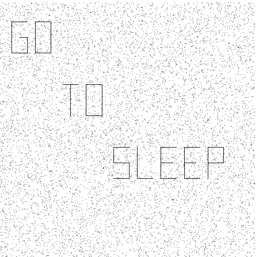
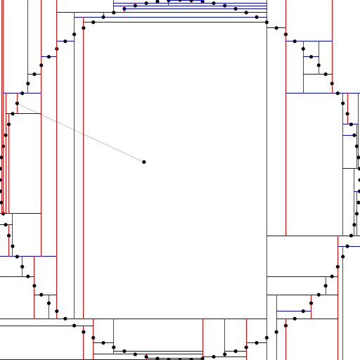
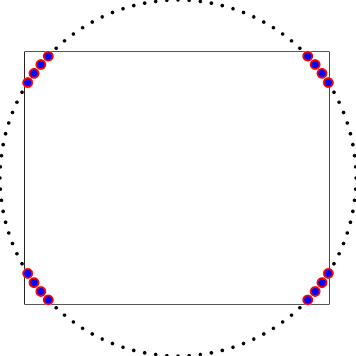

Algorithms
==========

This repository contains Java code examples based on the online course Algorithms, [Part 1](https://www.coursera.org/learn/algorithms-part1) 
and [Part 2](https://www.coursera.org/learn/algorithms-part2), taught by Kevin Wayne and Robert Sedgewick and offered by Princeton University 
on Coursera. The online lessons are based on the book Algorithms, 4th Edition, by the same authors. Additional material is also available from 
the [book's website](https://algs4.cs.princeton.edu/home/). This repository contains also my submissions to the programming assignments. This 
is a work in progress, see the assessments to know whether the code passes all the tests for correctness, memory, timing and other metrics. 
Maven is used to compile and execute the code. **The Java files that have been developed as solutions to the assignments are encrypted in order 
to comply with the Coursera Honor’s Code** (see [Source Code Encryption](#Source-Code-Encryption) section).

## Compile and execute
You can compile and execute the code using Java or Maven.

### Compile and execute with Java
In order to compile the java source files you have first to create a folder that will contain all the compiled classes. You 
can organize the folder as with Maven, with a *target* folder and a *classes* sub-folder. From the project root folder execute

```
$ mkdir -p target/classes 
```
In order to compile the Java code you need the [algs4.jar](https://algs4.cs.princeton.edu/code/) Java library to be added to the classpath. In 
the example the library is in the *lib* folder. Since the Java compiler cannot find recursively all the Java files by itself, you need to add a 
bash *find* command

```
$ javac -cp "lib/algs4.jar" -d target/classes $(find src/main/java -name '*.java')
```

In order to execute a Java class, from the project root folder, you need to add the compiled classes and the algs4.jar library to the classpath. 
As an example the command 

```
$ java -cp "lib/algs4.jar;target/classes" searching.WordCounter < resources/searching/tinyTale.txt
```

executes the *WordCounter* Java class, in the *searching* package, that takes in input a stream from a file (not the file name !) containing 
text and writes, in the standard output, the number of distinct words and the complete words list. 

It can be useful to execute some of the classes that are provided in the algs4.jar library. As an example

```
$ java -cp "lib/algs4.jar" edu.princeton.cs.algs4.FrequencyCounter 8 < resources/searching/tinyTale.txt
```

executes the Java class FrequencyCounter, in the edu.princeton.cs.algs4 package in the algs4.jar library, that takes as an argument the minimum 
length of a word to be counted, a list of words from the input stream fed by a text file, and prints the most frequent word with at least that 
length.     

### Compile and execute using Maven
You can compile all the Java classes using Maven

```
$ mvn compile
```

When the command returns, a new *target* folder is created, as Maven's convention, with a sub-folder *classes* containing all the compiled java 
classes. Examples of how to execute a Java class using Maven are provided in the following sections. 

## Part I
Part I covers elementary data structures, sorting, and searching algorithms. 

### Week 1
The main topics of the 1st week are analysis of algorithms and union-find. An algorithm should not only be correct, that is, provide the expected 
result, it should do so in a reasonable amount of time. The performance of an algorithm is measured in terms of the size of its input N. For example
we want to know the amount of time that is required by our algorithm to sort N strings. Algorithms are commonly classified by their order-of-growth

|Class|Order-of-growth|
|-----|--------------:| 
|constant|1|
|logarithmic|log(N)| 
|linear|N|
|linearithmic|N*log(N)|
|polynomial|N^2, N^3|
|exponential|2^N|
 
Algorithms that needs polynomial time to process do not scale, let alone exponential times, so our goal is to discover algorithms that solve our problems in less than polynomial 
time. A first example of the relevance of the performances of an algorithm to being able to solve problems in the real world is union-find or finding
whether two nodes in a graph are connected. This abstract problem arises in many applications, one of them is percolation, [this week assignment](https://coursera.cs.princeton.edu/algs4/assignments/percolation/specification.php), 
in which the goal is to determine the number of sites that have to be opened for a square lattice to percolate. A 2 dimensional lattice percolates if any open site
in the top row can be connected through a path of open sites to an open site in the bottom row. The ratio between the number of open sites
and the total number of sites is called [percolation threshold](https://en.wikipedia.org/wiki/Percolation_threshold) and it is a constant that represents a phase transition of the system. No analytical solution
has been found so far to determine this threshold. The square lattice is made up of N^2 blocked site that are opened randomly one by one till the system 
percolates. A Java class is available to execute many tests so that the result is statistically significant. It can be executed from the root folder with 
the command

```
$ java -cp "lib/algs4.jar;target/classes" assignments.percolation.PercolationStats 200 10000
```

where the first argument is the number N that is used to build the N^2 square lattice and the 2nd argument is the number of tests. The results are printed out 

```
mean                    = 0.592671
stddev                  = 0.009708
95% confidence interval = [0.592480, 0.592861]
```

Three algorithms are discussed as possible solution: quick-find, quick-union and weighted quick-union. The first two algorithms are quadratic-time while weighted
quick-union is logarithmic and so can be used for real world applications.   

A lattice can be visualized using a Java application provided in the assignment and executing the command as in the example below

```
$ mvn exec:java -Dexec.mainClass="assignments.percolation.PercolationVisualizer" -Dexec.args="resources/assignments/percolation/luigi_selmi.txt"
```


### Week 2
The topics of this week are collections, queues and stacks, and elementary sorting methods. Items in a queue follow the first-in-first-out (FIFO) rule while items in stacks follow
the last-in-first-out (LIFO) rule. They can be implemented using linked list or arrays. Since arrays have to be declared with a size they may need to
be resized. The assignment is about building a collection that supports adding and removing items from either the front or the back of the data structure. 
A second task is to create a randomized queue in which the item removed is chosen uniformly at random among items in the data structure.
The Java code for the [programming assignment](https://coursera.cs.princeton.edu/algs4/assignments/queues/specification.php) is in the queues 
folder. You can execute the code using Maven

```
$ mvn exec:java -Dexec.mainClass="assignments.queues.Permutation" -Dexec.args="8" < resources/assignments/queues/distinct.txt
```

The sorting methods introduced in this week lecture are selection sort, insertion sort and shellsort. They can be used to sort arrays of objects but since 
their time complexity is N^2 for the first two and N^(3/2) for shellsort they are best used with small arrays. A useful property of some sorting methods is stability.
Insertion sort is stable so that it can be used to sort an array of objects using different keys preserving the order of each sorting. Selection sort and shellsort
are not stable.

### Week 3
This week's lecture is about two sorting algorithms: mergesort and quicksort. Mergesort is an example of the divide and conquer paradigm. It first divides an array into two
halves, then recursively sorts each half, and finally merge the two halves. Mergesort is used in Java to sort objects. A nice property of mergesort is that it takes a time
proportional to Nlog(N) to sort an array of size N. Mergesort is also stable. The disadvantage is that it needs an extra space proportional to N. 
Quicksort is also a recursive algorithm. The algorithm begins with a partition phase in which for each entry in an array it moves larger entries to the right and smaller entries 
to the left and finally it recursively sorts the parts. Quicksort takes a time proportional to Nlog(N) to sort an array of N entries and it does not require extra space. Quicksort
is faster than mergesort but the disadvantage is that quicksort is not stable. Quicksort can take quadratic time if the input array is already sorted or partially sorted so usually
the input array is randomly shuffled to improve the performances. Sorting algorithms are used in many obvious and non obvious applications from sorting a list of strings or a search result
to enabling binary search, finding duplicates and also in computational biology and physics. One task of this week's assignment is to write an algorithm based on sorting that can 
find line patterns in a given set of points in a plane. The algorithm based on sorting can be compared with one that follows a brute force approach to solve the same problem and it can be seen
that is faster than the brute force algorithm when the number of points is more than one thousand. The plan of the fast algorithm is as follows: given one point p the algorithm computes the 
slopes of the segments that join p to all the other points and sorts the points according to the slopes they make with p. When there are four or more adjacent points that have the same slope 
with p they belong to the same (maximal) segment. The Java code for the [programming assignment](https://coursera.cs.princeton.edu/algs4/assignments/collinear/specification.php) is in the 
collinear folder. You can execute the code using Maven

```
$ mvn exec:java -Dexec.mainClass="assignments.collinear.FastCollinearPoints" -Dexec.args="resources/assignments/collinear/mystery10089.txt" 
```

As an example of the difference in performance between the two algorithms we use a data set that contains more than 10000 points. The fast algorithm based on sorting completes the task in
30 seconds on average, while the brute force algorithm needs more than one hour and a half. Clearly the message that emerges from the segments is a suggestion for those who use the brute force 
approach.

```
Elapsed time (seconds): 29.558000
Number of segments: 34
(1500, 30001) -> (3499, 30001)
(1500, 26001) -> (1500, 30001)
(1500, 26001) -> (3500, 26001)
(3500, 26001) -> (3500, 28001)
(2500, 28001) -> (3500, 28001)
(4501, 29999) -> (6501, 29999)
(4501, 25999) -> (4501, 29999)
(4501, 25999) -> (6501, 25999)
(6501, 25999) -> (6501, 29999)
(8000, 22000) -> (10000, 22000)
(9000, 18003) -> (9000, 22000)
(11000, 21995) -> (13000, 21995)
(11000, 17995) -> (11000, 21995)
(11000, 17995) -> (13000, 17995)
(13000, 17995) -> (13000, 21995)
(14500, 14000) -> (16499, 14000)
(14500, 12001) -> (14500, 14000)
(14500, 12001) -> (16500, 12001)
(16500, 10000) -> (16500, 12001)
(14499, 10000) -> (16500, 10000)
(17501, 9998) -> (17501, 13998)
(17501, 9998) -> (19501, 9998)
(20500, 13999) -> (22500, 13999)
(20500, 9999) -> (20500, 13999)
(20500, 11994) -> (22000, 11994)
(20500, 9999) -> (22500, 9999)
(23500, 13997) -> (25500, 13997)
(23500, 9997) -> (23500, 13997)
(23500, 11997) -> (25000, 11997)
(23500, 9997) -> (25500, 9997)
(26500, 13996) -> (28500, 13996)
(26500, 9996) -> (26500, 13996)
(26500, 11996) -> (28500, 11996)
(28500, 11996) -> (28500, 13996)
```
 


### Week 4
The main topics are priority queues and the heap sort algorithm. A Priority queue is a data structure  that provides two
main APIs:

* insert
* remove the maximum

It can be implemented using a stack or a queue but it's more convenient to use a heap-ordered binary tree on top of an array. The heapsort 
algorithm is an optimal sorting algorithm that can be divided in two phases. In the 1st phase the algorithm builds an heap-ordered binary tree 
with the maximum value at its root. In the 2nd phase, the root element is repeatedly exchanged with the last one and removed in order to produce 
a list of ordered elements. A priority queue can be used to implement the A* algorithm and solve the 8-puzzle and the 15-puzzle finding the least 
set of tile moves to reach the goal with all the tiles ordered. The Java code for the [programming assignment](https://coursera.cs.princeton.edu/algs4/assignments/8puzzle/specification.php) 
and solver of the puzzles is in the puzzle folder. As usual you can execute the code using Maven

```
$ mvn exec:java -Dexec.mainClass="assignments.puzzle.Solver" -Dexec.args="resources/assignments/puzzle/puzzle05.txt"
```
As an example we use the Java code to solve a 8-tiles puzzle in 5 moves.
 
```
Minimum number of moves = 5
3
4 1 3
0 2 6
7 5 8

0 1 3
4 2 6
7 5 8

1 0 3
4 2 6
7 5 8

1 2 3
4 0 6
7 5 8

1 2 3
4 5 6
7 0 8

1 2 3
4 5 6
7 8 0
```

### Week 5
This is the culminating section of the 1st part of the course, where all what we learned before about linked list, arrays, sorting algorithms 
and recursion are put in use to address the problem of building and using symbol tables to store and search key-value pairs. Symbol 
tables are known under different names such as dictionaries, indices and associative arrays. Unordered symbol tables can be implemented using 
linked lists or arrays in which strings can be used as keys instead of integers. Accessing an unordered symbol table requires a time proportional 
to its size and the insertion of N key-value pairs requires a time proportional to N^2. Symbol tables in which the keys are ordered have 
better performances and can support numerous useful methods. Binary search trees (BST) are an implementation of symbol tables in which the data
is structured in nodes that contain a value, a key and two links, the left link and the right link. The left link connects the given node to a 
subtree whose nodes have smaller keys than the given node, while the right link connects to subtree whose nodes have larger keys. Search and 
insert operations in BST require a time proportional to log(N) on average. Since with BST the shape of the tree depends on the order in which the
nodes are added to the BST, in the worst case the tree that results from an insertion of N key-value pairs in a BST can be unbalanced and look 
like a chain of left links so that accessing a node can require a time proportional to its size. In order avoid such situations and keep the tree 
balanced other BST have been developed that allow more than one key and more than two links that guarantee a height proportional to log(N) even 
in the worst case scenario. A 2-node is node with one key and two links as in BST, a 3-node is a node with two keys and three links. The data 
structure that is built with these two types of nodes is called 2-3 tree. A red-black BST is a 2-3 tree in which a 3-node is represented as two 
2-nodes connected by a left "red" link. The color of the link is represented by a flag in the code. Symbol tables are behind many important 
applications such as databases and search engines. One other remarkable application of BST is computational geometry in which geometric properties
of objects, such as point coordinates, are used as keys in a BST, enabling the implementation of useful methods such as range search and nearest-neighbor
search. The [programming assignment](https://coursera.cs.princeton.edu/algs4/assignments/kdtree/specification.php) requires the development of two Java
classes to implement such two methods in two different ways, one based on the use of a balanced BST implementation that is available in the java.util package,
and one that requires the implementation of a 2d-tree, that is a binary tree that corresponds to a recursive partition of the plane so that at each level 
of the tree the plane is divided alternatively by a horizontal or vertical line that passes through each node in that level of the tree. The 2d-tree
adapts gracefully to the distribution of the points in the plane and it is often a better solution than the grid approach in which the plane is divided
into equally sized squares, particularly when the points are not evenly distributed such as in geographic applications. As an example of how the 2d-tree
recursively splits the space into two rectangles every time a point is created in the plane, and its corresponding node is added to the 2d-tree, 
can be seen with the Java class KdTreeVisualizer.java that draws the points clicked by the user in the standard drawing window and the splitting lines.

```
$ mvn exec:java -Dexec.mainClass="assignments.kdtree.KdTreeVisualizer"
```

An example of the partition of the plane to address the nearest neighbor search is shown in the figure below where 100 points are distributed in 
a circle with a query point connected to the nearest point in the circle


 
The figure can be created by executing the command

```
$ mvn exec:java -Dexec.mainClass="assignments.kdtree.KdTree" -Dexec.args="resources/assignments/kdtree/circle100.txt"
```

We use the same data set to show the 2d-tree solution of the range search problem in which our two solutions are used to search the points that lie within 
a rectangle drawn at run time. The red color represents the points that have been found by the algorithm based on the Java TreeSet and the blue color
represents the points that have been found using our 2d-tree implementation. The fact that both algorithms have found the same points guarantees that
our 2d-tree implementation is correct.



The Java class NearestNeighborVisualizer.java reads a sequence of points from a file (specified as a command-line argument) and inserts those 
points into a 2d-tree. Then, it performs nearest-neighbor queries on the point corresponding to the location of the mouse in the standard drawing 
window.

```
$ mvn exec:java -Dexec.mainClass="assignments.kdtree.NearestNeighborVisualizer" -Dexec.args="resources/assignments/kdtree/circle100.txt"
```

The Java class RangeSearchVisualizer.java reads a sequence of points from a file (specified as a command-line argument) and inserts those points 
into a 2d-tree. Then, it performs range searches on the axis-aligned rectangles dragged by the user in the standard drawing window.

```
$ mvn exec:java -Dexec.mainClass="assignments.kdtree.RangeSearchVisualizer" -Dexec.args="resources/assignments/kdtree/circle100.txt"
```

### Week 6
This week is about hash tables. There is no programming assignment. 

## Part II
Part II focuses on graph and string-processing algorithms.

### Week 1
This week is about undirected and directed graph (aka digraphs). The [programming assignment](https://coursera.cs.princeton.edu/algs4/assignments/wordnet/specification.php) 
is about creating a digraph from the **WordNet semantic lexicon** and finding specific paths between the synsets (vertices) and computing the relatedness 
of two nouns. Three Java classes must be implemented for this assignment. The 1st one to be implemented is SAP.java that is used to compute the 
shortest ancestral path between two vertices. You can use SAP.java, with some test files, executing the Java class and entering pair of integers, 
that represent two vertices, from the command line

```
$ mvn exec:java -Dexec.mainClass="assignments.wordnet.SAP" -Dexec.args="resources/assignments/wordnet/digraph1.txt"
 ```
 
The 2nd Java class to be implemented is WordNet.java that reads two files. The 1st file contains a set of synsets from WordNet, and the 2nd file 
contains the relationships (hypernyms) between the vertices. You can test the correctness of the implementation by executing its main method.

```
$ mvn exec:java -Dexec.mainClass="assignments.wordnet.WordNet" -Dexec.args="resources/assignments/wordnet/synsets.txt resources/assignments/wordnet/hypernyms.txt"
```

```
Is "yellowlegs" a noun ? true
synset id for noun "zone" is 82150
synset id for noun "zone" is 82151
synset id for noun "zone" is 82152
synset id for noun "zone" is 82153
The SAP for "worm" and "bird" is animal animate_being beast brute creature fauna .
The distance between the nouns "worm" and "bird" is 5.
The distance between the nouns "white_marlin" and "mileage" is 23.
The distance between the nouns "Black_Plague" and "black_marlin" is 33.
The distance between the nouns "American_water_spaniel" and "histology" is 27.
The distance between the nouns "Brown_Swiss" and "barrel_roll" is 29.
```

Finally the 3rd class, Outcast.java, can be used to measure the semantic distance between words, provided in a file, to return the word that is 
the least related to the other ones, as in the example where outcast5.txt contains the words "horse", "zebra", "cat", "bear", "table", and Outcast 
returns correctly the word "table".

```
$ mvn exec:java -Dexec.mainClass="assignments.wordnet.Outcast" -Dexec.args="resources/assignments/wordnet/synsets.txt resources/assignments/wordnet/hypernyms.txt resources/assignments/wordnet/outcast5.txt"
```

### Week 2
This week is about undirected and directed edge-weighted graphs in which a weight, or cost, is associated to each edge. The addition of a weight 
enables the representation of many practical problems where a weight can represent the distance between two vertices or some other parameter. 
The main algorithms discussed are Prim's algorithm and Kruskal's algorithm to find the minimum spanning tree in an edge-weighted undirected graph, 
and the Dijkstra's algorithm to find the shortest paths from a source vertex to all the other vertices in a directed edge-weighted graph with 
nonnegative weights. One important class of problems, that can be represented by edge-weighted directed graphs and modeled as shortest-paths 
problems, is job scheduling. The [programming assignment](https://coursera.cs.princeton.edu/algs4/assignments/seam/specification.php) is about 
**seam-carving**, a content-aware image resizing technique. The code in SeamCarver.java provides the API to find horizontal and vertical seams. A vertical
seam is a path, from the top border of the image to the bottom one, in which each pixel is chosen to have the minimum energy among the adjacent 
pixels. The same applies for horizontal seams that go from the left border of the image to the right one. The Java class can be used by a client 
application such as ResizeDemo. As an example the following command removes 200 vertical seams and 100 horizontal seams from an image of 600x300 
pixels of a chameleon so that the image size will be reduced to 400x200 preserving its main characteristics.   
   
```
$ mvn exec:java -Dexec.mainClass="assignments.seam.ResizeDemo" -Dexec.args="resources/assignments/seam/chameleon.png 200 100"
```
The original image:


The image resized using seam-carving


  
### Week 3
The material of the 3rd week is about network-flow algorithms. These algorithms are of great interest because they can be used to solve optimization
problems in many different contexts, for instance to find the optimal way to distribute oil through a pipeline network from the oil field to a refinery. 
A common network-flow algorithm is the Ford-Fulkerson scheme. It is based on a graph whose edges can have two attributes: a capacity and a flow. The
edge's capacity is a number that specifies the maximum value that can be moved between its vertices, and the flow is the value that is actually used.
The algorithm is also called **maxflow algorithm** because it solves the problem of finding the best way to distribute a flow from a source through a network to a
sink so that the flow is maximal given the capacities of the edges. In order to showcase the applicability of the scheme to many different applications, 
it will be used in the [programming assignment](https://coursera.cs.princeton.edu/algs4/assignments/baseball/specification.php) to solve the [baseball elimination problem](https://en.wikipedia.org/wiki/Maximum_flow_problem#Baseball_elimination).
As an example, the following command finds which team is mathematically eliminated in a baseball division with 5 teams. Given the scenario in resources/assignments/baseball/teams5.txt
```
Team        wins loss left  NY Bal Bos Tor Det
----------------------------------------------
New_York     75   59   28    0   3   8   7   3
Baltimore    71   63   28    3   0   2   7   7
Boston       69   66   27    8   2   0   0   3
Toronto      63   72   27    7   7   0   0   3
Detroit      49   86   27    3   7   3   3   0
```   

Executing baseball elimination

```
$ mvn exec:java -Dexec.mainClass="assignments.baseball.BaseballElimination" -Dexec.args="resources/assignments/baseball/teams5.txt"
```

produces the desired output

```   
Baltimore is not eliminated
Boston is not eliminated
Detroit is eliminated by the subset R = { Toronto Boston Baltimore New_York }
New_York is not eliminated
Toronto is not eliminated
```

### Week 4
The first topic of the 4th week is about specialized algorithms for searching in symbol tables with string keys. The difference with symbol tables discussed
in the first part of the course is that the algorithms don't use comparisons for searching and so they can be faster. The 2nd topic is substring search that has 
application in many fields, from search engines to genetics. The [programming assignment](https://coursera.cs.princeton.edu/algs4/assignments/boggle/specification.php) is about
developing an application to find all the valid words composed of random letters displayed on cubes' faces and kept on a board, as in the word game Boggle. The longer the word found
the higher is the score. The main steps are first building the adjacency list of each cube and then searching for words, using letters on adjacent cubes, that are contained in a 
dictionary. The dictionary of valid words can be conveniently stored in a Trie, a symbol table with string keys, while the search can be performed recursively using depth-first search 
on the graph of cubes with their adjacent neighbors. The Boggle solver can be tested using static board and dictionary files as in the example  

```
$ mvn exec:java -Dexec.mainClass="assignments.boggle.BoggleSolver" -Dexec.args="resources/assignments/boggle/dictionary-algs4.txt resources/assignments/boggle/board4x4.txt"
```

that outputs the valid words that have been found using the letters in the given board with their score

```
AID, score = 1
DIE, score = 1
END, score = 1
ENDS, score = 1
EYE, score = 1
ONE, score = 1
ONES, score = 1
PAID, score = 1
PAINS, score = 2
PAT, score = 1
PATE, score = 1
SEND, score = 1
SIDE, score = 1
SIN, score = 1
SINE, score = 1
SIT, score = 1
SITE, score = 1
TAT, score = 1
TIE, score = 1
TIED, score = 1
TIN, score = 1
TINY, score = 1
TYPE, score = 1
UNIT, score = 1
UNITE, score = 2
UNITED, score = 3
USE, score = 1
YET, score = 1
YOU, score = 1
Number of words found = 29, Score = 33, Timing = 0.039000 (seconds)
```
### Week 5
The topics of the 5th week are **regular expressions** and **data compression**. A regular expressions, by definition, is a pattern that describes a set of strings. They are used in substring search when the pattern to be found is not completely specified. For example 
we might want to search for a substring in a genomic sequence that stretches 5 bases, starting with adenine A and cytosine C and ending with thymine T, without specifying exactly which bases are in between. Regular expressions allows the use of operators to define the set of strings
to be searched, the fundamental ones being concatenation, closure, and the logic or operator. An application that can interpret regular expressions, parses the expression and builds a nondeterministic finite-state automaton that will be able to find the pattern in the text. The
most famous such application is **grep** that is available in any unix-like operating system and can be used, as in our simple use case in which only the concatenation operator is used  

```
$ echo "ACAGCATACTATCGGGAACTATCCTACGAT" | grep -o -e "AC..T"
```

that prints out the list of occurrences of the substrings found in the sequence that follow the pattern

```
ACTAT
ACTAT
ACGAT
```

Data compression is still an important topic since it enables to save space for data storage and reduce the amount of time to transfer data. It is also the topic of this week's assignment. The [assignment](https://coursera.cs.princeton.edu/algs4/assignments/burrows/specification.php) covers only lossless compression for which no information 
is lost and the data after compression and expansion is exactly the same as the original one. The measure of the ability of an algorithm to compress a data set is called compression ratio, that is the ratio between the size of the compressed data and the size of the original one. A lossless
compression algorithm exploits three characteristics of a data set, binary data or text: the alphabet used to represent the data, the presence of long sequences of identical bits/characters, and the frequency in which different characters are used. These three characteristics of the data are 
exploited in the Java classes that must be implemented for the Burrows-Wheeler data compression algorithm in order to prepare the data for compression using the Huffman algorithm. The Java classes must be used in sequence for compression and in the reverse order for expansion.
 
For compression use the Java classes as in the following command:

```
$ java -cp "lib/algs4.jar;target/classes" assignments.burrows.BurrowsWheeler - < resources/assignments/burrows/abra.txt | java -cp "lib/algs4.jar;target/classes" assignments.burrows.MoveToFront - | java -cp "lib/algs4.jar" edu.princeton.cs.algs4.Huffman - | java -cp "lib/algs4.jar" edu.princeton.cs.algs4.HexDump 16
```

For expansion, follow the next example:

```
$ java -cp "lib/algs4.jar" edu.princeton.cs.algs4.Huffman + < resources/assignments/burrows/abra.txt.bwt.mtf.huf | java -cp "lib/algs4.jar;target/classes" assignments.burrows.MoveToFront + | java -cp "lib/algs4.jar;target/classes" assignments.burrows.BurrowsWheeler + 
```

## Source Code Encryption
The Java source code of the solution of the assignments has been encrypted to comply with the [Coursera Honor's Code](https://learner.coursera.help/hc/en-us/articles/209818863-Coursera-Honor-Code) using [OpenSSL](https://www.openssl.org/)
and the Advanced Encryption Standard (AES) symmetric cipher with a 256 bits long key in CBC mode. The command for the encryption is like in the example

```
$ openssl enc -e -aes-256-cbc -in SeamCarver.java -out SeamCarver.java.enc -pass file:secret
```

where "secret" is the name of the file containing the pass-phrase. Use the next command for decryption 
  
```
$ openssl enc -d -aes-256-cbc -in SeamCarver.java.enc -out SeamCarver.java -pass file:secret
```

## Computational Complexity of Algorithms
### Abstract Data Types
Here we present the most used data types that are used in many applications. Each data type provides a set of APIs to add, 
look up or remove items. The APIs can be implemented with algorithms that may have different performances.

#### Stack
A stack is a data type that implements a Last-In-First-Out data access policy. It can be based on a linked list and must 
implement two APIs: push() to insert a new element on the top of the stack, and pop() to remove one element from the top.
|API|Running Time|
|---|------------|
|push()|constant|
|pop()|constant|
#### Queue
A queue is a data type that implements a First-In-First-Out data access policy. It can be based on a linked list and must 
implement two APIs: enqueue() to add an element to the tail of the queue and dequeue() to remove the first element from the head of the queue.
|API|Running Time|
|---|------------|
|enqueue()|constant|
|dequeue()|constant|

#### Priority Queue
A priority queue is a data type that provides an API to insert an element, similarly to a queue or a stack, but instead of implementing a 
method to remove the oldest element like in a queue, or the newest one like in a stack, a priority queue implements a method to remove the 
element with the maximum value. The priority queue is based on a heap-ordered complete binary tree that can be implemented on top of an array. 
A binary tree is heap-ordered when the key in each node is equal or larger than its children’s keys.
|API|Running Time|
|---|------------|
|insert()|log(N)|
|delMax()|log(N)|

### Sorting algorithms
The table presents the running time of the main sorting algorithms in the worst, average and best case. An algorithm that does not need any 
additional space is said to be in-place. A sorting algorithm is said stable if it preserves the relative of equal keys.  
|Algorithm|in-place|stable| worst|average|Notes|
|---------|--------|------|------|-------|-----|
|Selection sort|Yes|No|N^2 / 2|N^2 / 2|N^2 / 2|N exchanges|
|Insertion sort|Yes|Yes|N^2 / 2|N^2 / 4|N|Use for small N or partially ordered|
|Shellsort|Yes|No|N^(3/2)|Subquadratic|Subquadratic||
|Mergesort|No|Yes|N*log(N)|N*log(N)|N*log(N)|NlogN guarantee|
|Quicksort|Yes|No|N^2 / 2|2N*log(N)|N*log(N)|NlogN probabilistic guarantee, fastest in practice extra space|
|Heapsort|Yes|No|N*log(N)|N*log(N)|N*log(N)|NlogN guarantee|
### Searching
|Algorithm|Running Time|Space|Notes|
|---------|------------|-----|-----|
|Binary search|log(N)||search in a sorted array|
|Binary search tree|log(N)|||
### Graphs
|Algorithm|Running Time|Space|
|---------|------------|-----|
### Strings
|Algorithm|Running Time|Space|
|---------|------------|-----|
